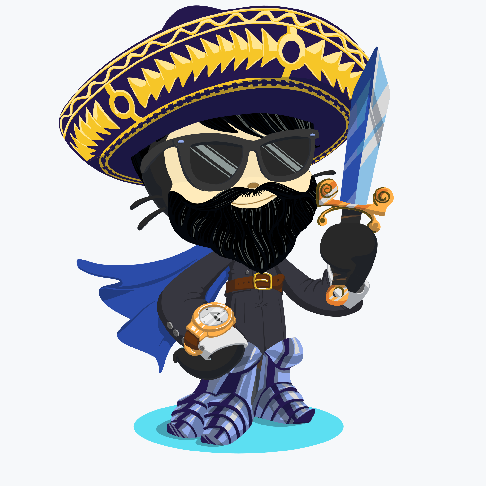

# Yasas the Octocat

## Capabilities

- Java, C, Design Patterns, Algorithms, Data Structures

- Web Technologies (FrontEnd): HTML, CSS, Bootstrap, JavaScript, ES6, React js, React-Redux,

- Web Technologies (BackEnd): Node.js, Express.js, REST API, GraphQL, SpringBoot

- Database: MySQL, MongoDB, Firebase

- Mobile App Development: Flutter

Catch me up on [Linkdin](https://www.linkedin.com/in/yasassandeepa/)
